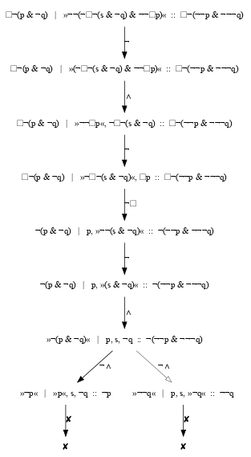

# Modal Tableau with Interpolation

Goal: a tableau prover for propositional logic, the basic modal logic K and propositional dynamic logic (PDL).
The prover should also find interpolants, following the method described by Manfred Borzechowski in 1988.
See <https://malv.in/2020/borzechowski-pdl/> for the original German text and an English translation.

## Notes and Examples

### Propositional Logic

There are two different provers:
one [based on lists](src/Logic/Propositional/Prove/List.hs).
and [a proper tableau](src/Logic/Propositional/Prove/Tree.hs).

Interpolation is also implemented twice:
once [replacing atoms by constants](src/Logic/Propositional/Interpolation/Naive.hs) as described in [Wikipedia: Craig interpolation](https://en.wikipedia.org/wiki/Craig_interpolation#Proof_of_Craig's_interpolation_theorem), and
 [using the tableaux](src/Logic/Propositional/Interpolation/ProofTree.hs).

### Basic modal logic K

    stack ghci src/Logic/BasicModal/Prove/Tree.hs
    λ> provable (Box (p --> q) --> (Box p --> Box q))
    True
    λ> provable (p --> Box p)
    False
    
    stack ghci src/Logic/BasicModal/Interpolation/ProofTree.hs
    λ> let (f,g) = ( Box ((At 'p') --> (At 'q')) , (Neg (Box ((At 's') --> (At 'q')))) --> (Neg (Box (At 'p'))) )
    λ> mapM_ (putStrLn .ppForm) [f, g]
    ☐¬(p & ¬q)
    ¬(¬☐¬(s & ¬q) & ¬¬☐p)
    λ> interpolateShow (f,g)
    Showing tableau with GraphViz ...
    Interpolant: ☐¬(¬¬p & ¬¬¬q)
    Simplified interpolant: ☐¬(p & ¬q)

The last command will also show this tableau:

See [the test file](test/basicmodal.hs) for more examples, including interpolation and consistency checks.

### PDL

Public web interface: <https://w4eg.de/malvin/illc/tapdleau/>

To run the web interface locally do `stack build` and then `stack exec tapdleau`.
For developing you can recompile and restart the web interface on any code changes Like this:

    stack build --file-watch --exec "bash -c \"pkill tapdleau; stack exec tapdleau &\""

## Automated Tests

Use `stack test` to run all tests from the [test](test/) folder.

For PDL we also use the files [formulae_exp_unsat.txt](data/formulae_exp_unsat.txt)
and [formulae_exp_sat.txt](data/formulae_exp_sat.txt)
from <http://users.cecs.anu.edu.au/~rpg/PDLComparisonBenchmarks/>.
Note: The files have been modified to use star as a postfix operator.

# TODO list

## PDL

Prover:

- [X] restricted language with Con, not Imp as primitive, as Borzechowski does
- [X] proper search: extend -> extensions (as in BasicModal)
- [X] add M+ rule
- [X] Only allow (At) on marked formulas (page 24)
- [ ] Check priorities / preferences of all rules.
- [X] mark active formula (as in BasicModal), needed for interpolation
- [X] also mark active formula for extra condition 4, and history-path for 6
- [ ] more uniform encoding of rules and closing conditions
- [ ] Implement extra conditions:
    1. [X] when reaching an atomic Box or NegBox, go back from n to *
    2. [X] instead of X;[a^n]P reach X
    3. [X] apply rules to n-formula whenever possible / prioritise them!
    4. [X] Never apply a rule to a ¬[a^n] node (and mark those as end nodes!)
    5. [ ] directly after M+ do not apply M-
    6. [X] close normal nodes with critical same-set predecessors (if loaded when whole path is loaded)
    7. [ ] every loaded node that is not an end node by 6, has a successor.

Interpolation:

- [X] copy from BasicModal and get it to compile
- [X] expose in web interface
- [X] fillIPs: all local rules
- [X] fillIPs: atomic rule
- [X] add interpolate tests for star-free formulas
- [X] Find test cases that fail due to the empty-side edge cases for (At)-interpolants?
- [X] Correct definition of (At)-interpolants in the empty-side edge cases.
- [X] TI, TJ, TK, canonical programs, interpolants for TK
- [X] use TI etc. to find interpolants for loaded sub-tableaux, iterate!
- [ ] fillIPs: end notes due to extra condition 4 ??

Bonus Information:

These are not needed to define interpolants, but part of the proof the definition is correct.

- [X] J and K sets from Definition 34
- [ ] extended tableau from Lemma 25 and 26.

Testing:

- [X] self-testing: generate random implication, check if provable, compute interpolant, check if it is indeed an interpolant
- [ ] check for agreement with other PDL provers
    - [ ] http://rsise.anu.edu.au/~rpg/PDLProvers/
    - [ ] https://www.irit.fr/Lotrec/
          see also https://github.com/bilals/lotrec
    - [ ] http://www.cs.man.ac.uk/~schmidt/pdl-tableau/
          (NOTE: prototype only, not working for nested stars)

Semantics:

- [X] Kripke models
- [X] satisfaction
- [X] generate random arbitrary models
- [X] build counter model from open tableaux - following Theorem 3

Nice to have:

- [ ] option to start with a given set/partition instead of a single (to be proven and thus negated) formula 
- [ ] use exact same syntax as Borzechowski (A for atomic programs etc.)
- [ ] add applicable extra conditions to rule annotation
- [X] web interface
- [ ] use Graphviz HTML labels for better readability, e.g. highlight the active formula.
- [ ] color the loading part of formulas/nodes
- [ ] store current/submitted formula in (base64?) URL hash, provide perma-link for sharing
- [ ] Use better data structures, [zipper](https://en.wikipedia.org/wiki/Zipper_(data_structure)) instead of `(TableauIP, Path)` pairs?

## See also

- <https://github.com/m4lvin/tablean> A formalization of the same method in Lean. Only covering Basic Modal Logic at this time.

## Related work

- Rajeev Goré and Florian Widmann (2009): An Optimal On-the-Fly Tableau-Based Decision Procedure for PDL-Satisfiability.
  <https://doi.org/10.1007/978-3-642-02959-2_32>

- Roman Kuznets (2015): Craig Interpolation via Hypersequents.
  <https://sites.google.com/site/kuznets/interpol_hyper_v2.pdf>

- Francesca Perin (2019): Implementing Maehara's Method for Star-Free Propositional Dynamic Logic.
  <https://fse.studenttheses.ub.rug.nl/20770/>
  <https://github.com/FrancescaPerin/BScProject>

- Other PDL provers are mentioned at <http://www.cs.man.ac.uk/~schmidt/tools/>.
